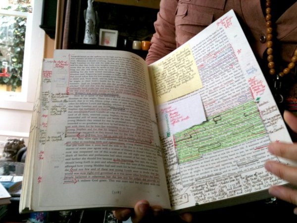
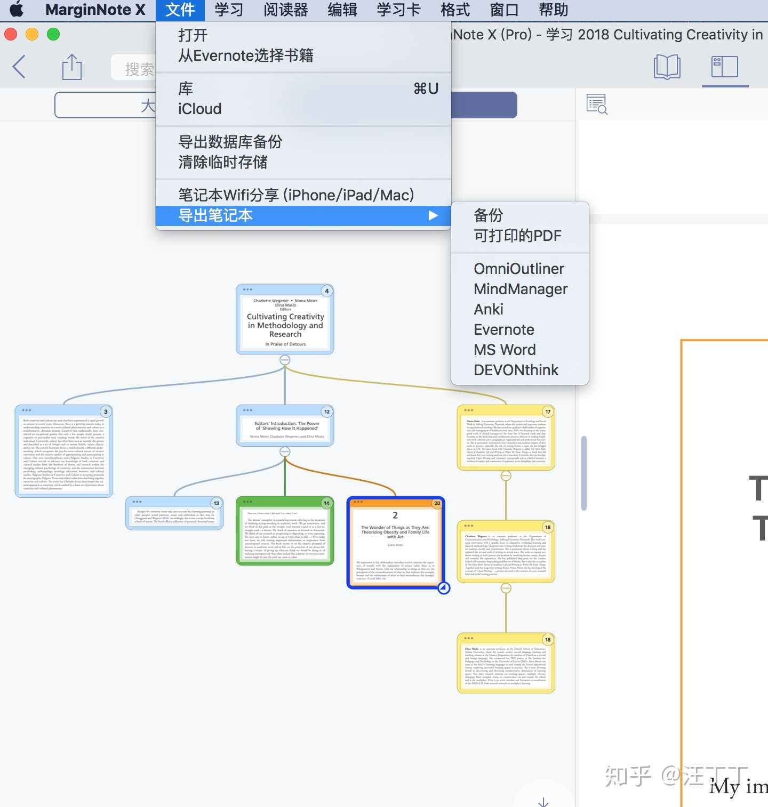
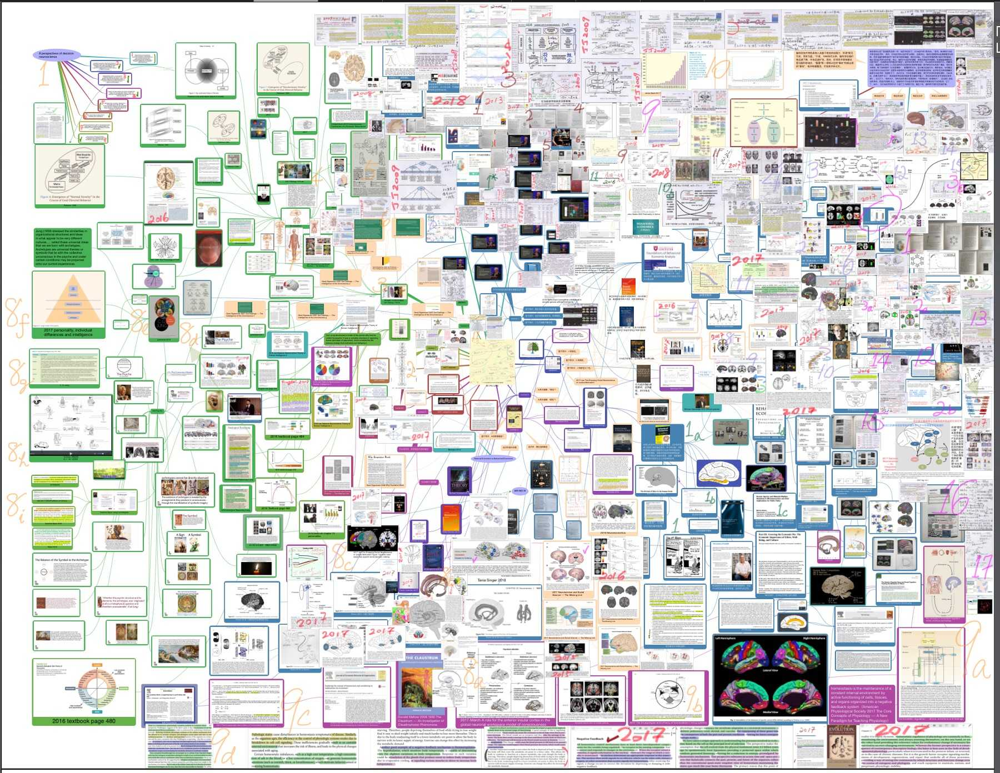

---

title: MarginNote 理解笔记
date: 2018-09-04 14:29:00
tags: [Toolbox, Reading]
categories: []
type: post

---

📒 读书工作流、方法论与学习闭环

<!-- more -->

👆 “MarginNote”, literally

---

## [MarginNote - 在 iPad 上提升学习效率，它可能是最合适的 PDF 阅读器](https://sspai.com/post/38905)

* 如何使用 MarginNote
* MarginNote 提供的工具：批注（摘录）、大纲、思维导图、记忆卡
* MarginNote 工作流：书、笔记本、摘录
* PDF 结构化：[传统的] 书签、大纲、页码 🆚 [MarginNote] 摘录、大纲、思维导图、记忆卡（上下文）
* MarginNote 应用 - 复习考试：回忆模式
* 扩展接口：Anki（学习卡）、OmniOutliner（大纲）、MindManager & iThoughts（思维导图）、Evernote（导图、大纲、书）、MS Word（大纲）、DEVONthink（笔记）

@路灯等灯等灯：

> 除了用在课业学习上，marginnote对于我这种喜欢深入阅读，尤其是阅读论说类书籍的人来说，是神器一样的存在。
>
> 《如何阅读一本书》践行分析阅读和主题阅读的平台，比纸质书还更好。
>
> 阅读时打开侧边栏，随时对划线的重点句子的主旨进行提炼，并调整其在大纲中的层级与位置，这样就顺利的将一本书肢解，成为了直观的思维导图和大纲，并可以即刻跳转至该条笔记的出处，哪怕是来自不同的书。」

---

## [MarginNote Pro 读书人的神器 - 知乎专栏](https://zhuanlan.zhihu.com/p/25392597)

阅读笔记流程：
1. PDF Expert 标注，做大概的整理知识整理
2. SimpleMind 思维脑图，知识图文化，用逻辑思维再梳理一遍，找出自己的逻辑
3. OmniOutliner Pro 大纲，把知识结构化

MarginNote Pro：标注，大纲，思维导图。完整工作流

---

## [MarginNote : 如此强大的笔记 App，每个人都该有 #iOS #Mac_AppSo](http://www.ifanr.com/app/744135)
MarginNote Pro - 剪书, 批注, 重组, 快速的创建思维导图和记忆卡来复习
http://v.youku.com/v_show/id_XMTc2NzgxMTc4MA==.html
* 应用内搜索（in-depth search）
* 下载网页（download as epub） 
* epub 页边笔记（KJV）

MarginNote 核心逻辑：
1. 标记、批注，都会被「剪藏」到一个笔记本，作为备用的笔记素材收集起来；
2. 这些笔记可以在页边、大纲列表、思维导图、学习卡集中不同的视图里自由切换；他们是联动的。

「这种将不同思维空间连接起来的能力可以促进学习中的创造力和记忆，是纸书或其他电子工具无法做到的。」

开发者 Sun Min 的使用思路：
> 我的工作流一般是就某一个主题建一个笔记本，然后把这个主题下最棒的资料 PDF 拖进来，然后陆续把看到的网页通过 MarginNote 的 EPUB 转存功能也拖进来。
> 在碎片的时间里把一片片摘录慢慢收集起来，然后有空再到思维导图和 Outline 里整理。最后用 Flashcards 回顾和记忆。
除此之外，Min 也推荐了知乎网友 @山羊月 的分享：[用 pdf 版看完大部头专著是怎样一种体验？](https://www.zhihu.com/question/43663694/answer/103097192) 以及 Einswell 的分享：[iPad 上有哪些实用得令人惊艳的 App？](https://www.zhihu.com/question/22678622/answer/121249367)

MarginNote 为解决碎片知识重组的问题。就像洛克的索引系统一样，MarginNote 不仅能让读者快速地找要查询的笔记内容，还可以完成一个更高难度的任务，即促进读者思考与反思。AppSo 也认为，无论是深度学习还是多线程任务处理，人都可以凭借科技，到达新的高度。在混乱中建立新秩序，是我们必须学会的技能。

[用 pdf 版看完大部头专著是怎样一种体验？_山羊月](https://www.zhihu.com/question/43663694/answer/103097192)

我们的阅读体验并不是来自于 PDF，而是来自于阅读 PDF 的软件。一个好的阅读软件给人带来的阅读体验和阅读效率的提升是多么显著。

前期主要利用 Nvivo 来阅读 PDF，这个工具应该被很多人熟知，是做质性研究编码的一个主要软件。但是国外很多人用 Nvivo 来读 PDF，因为它具备很好的信息整理，归类，思维导图建立等功能，是做文献综述的大杀器。简而言之，你可以把不同 PDF 文件上的信息归为一个个节点，每一个节点代表一个知识元，以后你每一次需要用到这个知识元的时候，只需要打开它，你之前整理的所有相关论文里的信息全部都在里面，轻轻一点自动跳转到 PDF 的段落。你还可以导入语音，视频，截图，笔记等各类文件，同时用思维导图来整理这些知识元，构建二级甚至三级知识网络。

在论文阅读过程中建立思维导图整理逻辑联系的重要性

同时这个软件也有缺陷。Marginnote标注的PDF和笔记似乎没法被其他PDF软件读取。同时 Marginnote 的UI设计有些丑不说，很多界面和功能的引导做的不好，学习曲线比较高。当然，Nvivo可能更高。最后，Marginnote还存在很多 Bug，目前正在等待下一个大版本更新，后续功能会进一步加强。

最后，我个人的理解是：处在当今这么一个知识爆炸的时代，对于信息的整理，对于软件的学习，实际上是科研能力的一个重要组成部分。而我们中国学生对这种能力的训练和思考远远不如西方国家的学生。我们甚至都没有建立起利用软件进行高效的信息整理和利用的意识。非常可怕的是，我们的信息整理和利用的意识还系统性的停留在对于「书本」和「笔记」实体的迷信阶段。这种实体诚然具有一定的优势，但却完全无法阻挡科技进步的脚步。我们的意识如果不更新，我们终有一天会发现我们自己信息整理和利用的效率远远落后于其他国家的学生，而这种落后导致的后果，就是信息壁垒，就是科技壁垒，就是发展壁垒。

一个工具如果不好用就不会被广泛接受；它被广泛接受也并不代表它就对你好用。

---

## [iPad 上有哪些实用得令人惊艳的 App？](https://www.zhihu.com/question/22678622/answer/121249367)

* 详细介绍了 MarginNote 的使用操作

---

## [MN&Anki天生CP，完美的学习闭环](http://www.jianshu.com/p/bef8270da09a)

* 介绍 MarginNote 和 Anki 的协作场景
* 分享 iPad Pro 的使用体验

---

## [忙碌时代的读书方法 - 汪丁丁的想法 - 知乎](https://www.zhihu.com/pin/980038458768809984)

忙碌时代的读书方法，今天我介绍晚近几个月我使用的一种新的阅读技术，我认为超过目前流传的那些。文献存多了，每一位学者都要建立自己的更好用的检索和阅读方法。我喜欢跨学科研究方法，围绕同一主题同时阅读许多文献。或许我尝试的几十种同类阅读软件里，这一款最佳。

我还没有挑战它的存书极限，应当不会太大，因为每次阅读任何一本书必须保存许多信息。

阅读时它自动保存的思维导图。使用笔记工具，每次需要标出重要段落，用矩形框出相关段落，可以跨页，可以无限延伸，这时，左栏就出现矩形之内的文字。我试过，输出笔记为PDF格式之后，可放大八倍，通常够用。这些矩形之间的关系，完全由你的思路决定。我习惯于将一本书的核心思路相互联结成一张图，然后就不再读这本书，只看图即可回忆书的细节。虽然文档很大，但日积月累，同一主题的不同文献阅读笔记，可合并为一本丁丁笔记，优势明显！

---

## [行为经济学心智地图 - 汪丁丁的想法 - 知乎](https://www.zhihu.com/pin/968748348639023104)

